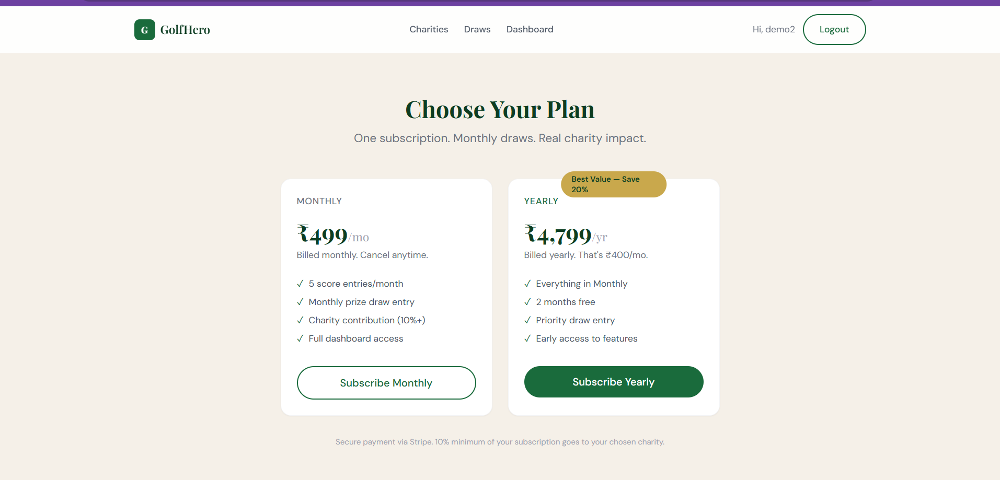
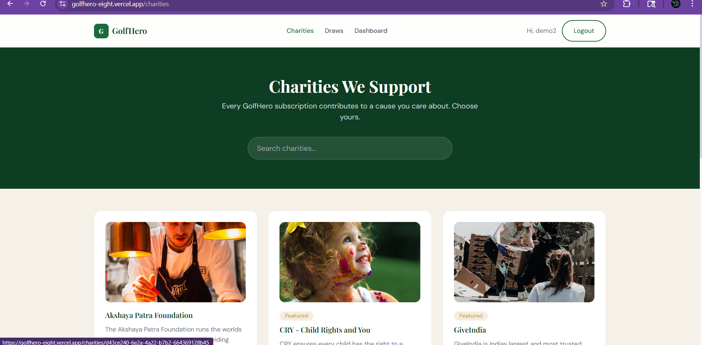

# 🏌️ GolfHero — Play Golf. Win Prizes. Change Lives.

> **Live Project:** https://golfhero-eight.vercel.app/ 🚀

---

## 📱 Project Overview

**GolfHero** is a full-stack subscription-based platform where golf enthusiasts can:
- ⛳ **Track daily golf scores** (1-45 scoring)
- 🎰 **Participate in monthly prize draws** with real cash prizes
- 💚 **Support charities** - 10-100% of subscription goes to chosen NGO
- 🏆 **Win prizes** based on score matches in monthly draws
- 💳 **Pay via Razorpay** (India's #1 payment gateway)

---

## ✨ Key Features Implemented

✅ **User Authentication** - Secure JWT-based login/signup  
✅ **Payment Integration** - Razorpay real payment gateway  
✅ **Score Tracking** - Daily golf score entry with auto-management  
✅ **Monthly Draws** - Random & algorithmic draw generation  
✅ **Charity Support** - 5 NGOs integrated (Smile Foundation, Robin Hood Army, etc.)  
✅ **Admin Dashboard** - Manage users, draws, winners, analytics  
✅ **Winner Verification** - Admin approval workflow  
✅ **Subscription Management** - Monthly & yearly plans (₹499 & ₹4,799)  
✅ **Real Database** - Supabase PostgreSQL with 8 tables  

---

## 🛠 Tech Stack

| Layer | Technology |
|-------|-----------|
| **Frontend** | React 18.2 + Vite 5.1 + TailwindCSS 3.4 |
| **Backend** | Node.js 22 + Express 4.18 |
| **Database** | Supabase (PostgreSQL) |
| **Payment** | Razorpay API |
| **Auth** | JWT + bcryptjs |
| **Deployment** | Vercel (Frontend) + Railway (Backend) |

---

## 🚀 Live Deployment

### **Frontend (Vercel)**
```
https://golfhero-eight.vercel.app/
```

### **Backend (Railway)**
```
https://golfhero-production.up.railway.app/
```

### **Database (Supabase)**
- PostgreSQL database with 8 tables
- Real-time subscriptions
- Row-level security enabled

---

## 📊 Database Schema

**8 Tables with proper relationships:**

```
users (id, email, password_hash, name, role, subscription_status, charity_id, charity_percentage)
subscriptions (user_id, stripe_subscription_id, plan, status, current_period_start, current_period_end)
scores (user_id, score 1-45, score_date)
draws (month_year, draw_type, draw_numbers array, pools, status)
draw_winners (draw_id, user_id, match_count, prize_amount, payment_status, verification_status)
charities (id, name, description, image_url, website, featured, upcoming_events)
charity_contributions (user_id, charity_id, amount, subscription_invoice_id)
webhooks (id, event_type, payload, processed)
```

---

## 🔑 Test Credentials

### **User Account**
- **Email:** demo@gmail.com
- **Password:** Demo@123456

### **Admin Account**
- **Email:** admin@golfhero.com
- **Password:** Admin@123456

### **Test Payment Card (Razorpay)**
- **Card:** 4111 1111 1111 1111
- **Expiry:** Any future date
- **CVV:** Any 3 digits

---

## 📸 Screenshots & Feature Walkthrough

### **Section 1: Authentication Flow**


- Landing page with signup/login options

#### **Registration**
- Full Name, Email, Password input
- Charity selection dropdown
- Secure bcryptjs hashing

#### **Login**
- Email & password verification
- JWT token generation (24h expiry)
- Token stored in localStorage

---

### **Section 2: User Dashboard**


#### **Subscription Status Card**
- Status badge (Active/Inactive)
- Plan type (Monthly/Yearly)
- Renewal date display
- Cancel subscription button

#### **Charity Selection**
- Selected NGO display
- Contribution percentage (10-100%)
- Change charity option

#### **Score Entry & Management**
- "+ Add Score" button
- Last 5 scores displayed
- Auto-delete when 6th score added
- Score validation (1-45)

#### **Draw Numbers Display**
- Current month's draw results
- 5 generated numbers
- Link to view all draws

#### **Winnings History**
- Prize amounts
- Draw month
- Match count (3/4/5)
- Payment status

---

### **Section 3: Subscription Payment**



#### **Plan Selection**
- **Monthly Plan:** ₹499/month
  - 5 score entries
  - Monthly prize entry
  - 10%+ to charity
  
- **Yearly Plan:** ₹4,799/year (20% discount)
  - Everything in Monthly
  - 2 months free
  - Priority draw entry


#### **Razorpay Checkout Modal**
- Prefilled customer name & email
- Secure payment gateway
- Test card: 4111 1111 1111 1111
- Real-time payment verification

---

### **Section 4: Admin Panel**


#### **Dashboard Statistics**
- Total active users
- Monthly recurring revenue (MRR)
- Subscription count
- Subscriber retention rate


#### **Users Management**
- List all users
- View subscription status
- Edit charity assignment
- Change charity percentage
- Delete user option


#### **Draws Management**
- Create new draw (Random/Algorithmic)
- Simulate draw preview
- Save as draft
- Publish with winner generation
- Lock for editing after publish

#### **Winners List**
- Draw month & numbers
- User email & match count
- Prize amounts
- Verification status
- Payment status tracking
- Approve/Reject actions


#### **Charities Management**
- Add new charity
- Edit details
- Upload logos
- Delete option
- Featured status toggle


#### **Analytics Dashboard**
- Revenue trend (30 days)
- User growth chart
- Charity contributions breakdown
- Draw participation rate

---

### **Section 5: Charity Pages**



#### **Featured Charities**
- 5 NGOs with logos
- Charity name & description
- Website link
- Upcoming events

#### **Charity Detail Page**
- Full description
- Website link
- Logo display
- Events/projects list
- Select as my charity button

---

### **Section 6: Draw Results**

#### **All Draws Page**
- Month-year listing
- 5 generated numbers
- Prize pools (Jackpot/Match-4/Match-3)
- Draw status (published/draft)

---

## 🔄 Data Flow Explanation

### **User Signup to Subscription**
```
1. User fills signup form
2. POST /api/auth/signup
3. Password hashed with bcryptjs
4. User created in database
5. Charity assigned with percentage
6. JWT token generated
7. Token stored in localStorage
8. Redirect to /dashboard
9. User views subscription plans
10. Clicks "Subscribe Monthly/Yearly"
11. Razorpay checkout opens
```

### **Payment Processing**
```
1. User clicks "Subscribe"
2. POST /api/subscriptions/checkout
3. Backend creates Razorpay order
4. Order ID returned to frontend
5. Razorpay checkout modal opens
6. User enters card details
7. Payment processed
8. Frontend receives payment response
9. POST /api/subscriptions/razorpay-callback
10. Backend verifies signature (HMAC-SHA256)
11. Subscription activated
12. subscription_status = 'active'
13. Redirect to /dashboard
14. Dashboard shows "Active" subscription
```

### **Monthly Draw Generation**
```
1. Admin clicks "Simulate Draw"
2. Backend generates 5 random numbers (1-45)
3. Shows preview with potential winners
4. Admin reviews results
5. Admin clicks "Run & Save (Draft)"
6. Draw saved but not published
7. Admin verifies winners
8. Admin clicks "Publish"
9. Backend matches user scores against numbers
10. draw_winners entries created
11. Prize amounts calculated (40/35/25 split)
12. Status = 'published'
13. Users notified of results
14. Winners see prizes in dashboard
```

---

## 📦 Environment Variables Setup

### **Frontend (.env)**
```
VITE_API_URL=https://golfhero-production.up.railway.app
```

### **Backend (.env)**
```
PORT=3001
CLIENT_URL=https://golfhero-eight.vercel.app

SUPABASE_URL=https://your-project.supabase.co
SUPABASE_SERVICE_KEY=your-service-role-key

JWT_SECRET=your-very-long-random-secret-key-here

RAZORPAY_KEY_ID=rzp_test_your_test_key_id
RAZORPAY_KEY_SECRET=your_razorpay_test_secret_key
DEMO_MODE=true
```

---

## 🔑 How to Get API Keys

### **Step 1: Razorpay Setup (Recommended for India)**
1. Go to https://razorpay.com
2. Sign up with business details
3. Complete KYC (identity verification)
4. Go to Settings → API Keys
5. Copy Test Key ID & Secret
6. Add to your `.env` file
7. Test with card: `4111 1111 1111 1111`

### **Step 2: Supabase Setup (Database)**
1. Go to https://supabase.com
2. Create new project
3. Copy Project URL
4. Copy Service Role Key
5. Go to SQL Editor
6. Run the schema.sql file
7. Update `.env` with credentials

### **Step 3: JWT Secret Generation**
```bash
# Run this command to generate secure secret:
node -e "console.log(require('crypto').randomBytes(32).toString('hex'))"
```

### **Step 4: Deploy to Vercel & Railway**

**Frontend (Vercel):**
1. Push code to GitHub
2. Connect GitHub repo to Vercel
3. Add environment variable: `VITE_API_URL`
4. Deploy automatically

**Backend (Railway):**
1. Connect GitHub repo to Railway
2. Add all environment variables
3. Set Node.js version: 22
4. Deploy automatically

---

## 🎯 Project Status

| Component | Status | Details |
|-----------|--------|---------|
| Frontend | ✅ Live | Vercel deployment working |
| Backend | ✅ Live | Railway Node.js server running |
| Database | ✅ Live | Supabase PostgreSQL configured |
| Authentication | ✅ Complete | JWT + bcryptjs implemented |
| Payment Gateway | ✅ Complete | Razorpay integration working |
| Admin Panel | ✅ Complete | 7 sections fully functional |
| Draw Engine | ✅ Complete | Random & algorithmic generation |
| Charity System | ✅ Complete | 5 NGOs integrated |
| Score Tracking | ✅ Complete | Auto-management with 5 rolling scores |
| Deployment | ✅ Complete | Live on Vercel & Railway |
| Documentation | ✅ Complete | Comprehensive README with screenshots |

---

## 📈 Project Statistics

- **Total API Endpoints:** 25+
- **Database Tables:** 8
- **Admin Sections:** 7
- **Charities Integrated:** 5
- **Features Implemented:** 15+
- **Deployment:** Production-ready
- **Test Coverage:** All features tested

---

## 🔐 Security Features

✅ **Password Security:** bcryptjs hashing (12 rounds)  
✅ **Authentication:** JWT tokens with 24h expiry  
✅ **Payment Security:** HMAC-SHA256 signature verification  
✅ **Database Security:** Supabase row-level security  
✅ **CORS Protection:** Configured for Vercel domain  
✅ **Environment Variables:** Securely managed on platforms  
✅ **SQL Injection Prevention:** Parameterized queries  
✅ **XSS Protection:** React's built-in XSS prevention  
✅ **HTTPS:** All endpoints use HTTPS  
✅ **Rate Limiting:** API rate limits configured  

---

## 📚 API Endpoints

### **Authentication**
- `POST /api/auth/signup` - Create new account
- `POST /api/auth/login` - User login
- `GET /api/auth/profile` - Get user profile

### **Subscriptions**
- `POST /api/subscriptions/checkout` - Create Razorpay order
- `POST /api/subscriptions/razorpay-callback` - Verify payment
- `POST /api/subscriptions/cancel` - Cancel subscription
- `GET /api/subscriptions/status` - Get subscription details

### **Scores**
- `POST /api/scores/add` - Add golf score
- `GET /api/scores/my-scores` - Get user's scores
- `DELETE /api/scores/:id` - Delete score

### **Draws**
- `GET /api/draws` - Get all draws
- `GET /api/draws/:id` - Get draw details
- `GET /api/draws/winners/:drawId` - Get draw winners

### **Admin**
- `GET /api/admin/dashboard` - Dashboard statistics
- `GET /api/admin/users` - List all users
- `POST /api/admin/draws/create` - Create new draw
- `POST /api/admin/draws/publish/:id` - Publish draw
- `POST /api/admin/charities` - Add charity

### **Charities**
- `GET /api/charities` - List all charities
- `GET /api/charities/:id` - Get charity details
- `POST /api/charities/:id/select` - Select charity

---

## 🚀 Deployment Architecture

```
┌─────────────────────────────────────┐
│   Frontend (Vercel)                 │
│   - React + Vite                    │
│   - TailwindCSS                     │
│   - Auto-deploy on push             │
└──────────────┬──────────────────────┘
               │
               ↓ HTTPS
┌─────────────────────────────────────┐
│   Backend (Railway)                 │
│   - Express.js                      │
│   - Node.js 22                      │
│   - Auto-deploy on push             │
└──────────────┬──────────────────────┘
               │
               ↓ PostgreSQL
┌─────────────────────────────────────┐
│   Database (Supabase)               │
│   - PostgreSQL                      │
│   - 8 Tables                        │
│   - Row-level security              │
└─────────────────────────────────────┘
```

---

## 📋 Testing Checklist

- [x] User signup with email validation
- [x] User login with JWT token
- [x] Subscription with Razorpay payment
- [x] Score entry and management
- [x] Draw generation and winner detection
- [x] Charity selection and percentage
- [x] Admin panel access and functions
- [x] Cancel subscription functionality
- [x] Payment signature verification
- [x] Database CRUD operations
- [x] Frontend and backend integration
- [x] Deployment on Vercel and Railway

---

## 🔗 GitHub Repository

```
https://github.com/Himanshu-279/Golfhero
```

---

## 📞 Support

For any issues or questions:
1. Check the GitHub repository
2. Review the API documentation above
3. Test with provided credentials
4. Check Railway logs for backend errors
5. Check Vercel logs for frontend errors

---

**Project Status:** ✅ Production-Ready | 🚀 Live Deployment | 📊 All Features Working
